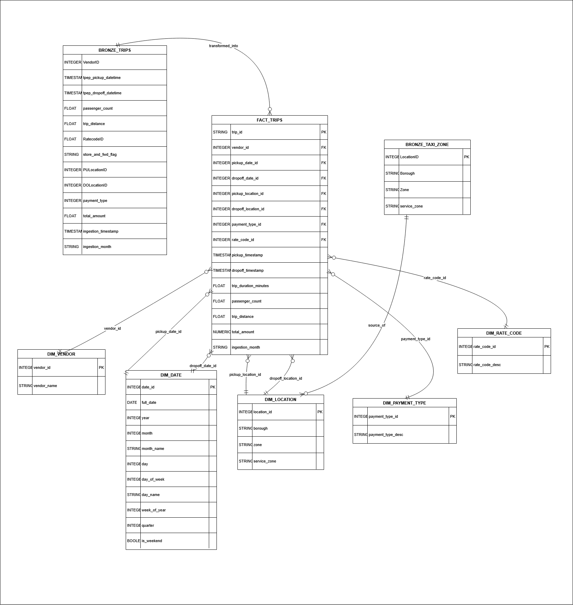

### NYC Taxi Analytics Pipeline

This repository contains an end‑to‑end, production‑style data pipeline for NYC Yellow Taxi trips on Google Cloud Platform (GCP). It ingests raw TLC parquet files, lands them in a **bronze** layer on GCS and BigQuery, then transforms them into a dimensional **gold** model for analytics.

---

### High‑Level Architecture

- **Source data**
  - NYC TLC Yellow Taxi monthly parquet files (`yellow_tripdata_YYYY-MM.parquet`) hosted on `cloudfront`.

- **Ingestion / Bronze layer**
  - **Cloud Scheduler** (Terraform) triggers a **Cloud Function** monthly.
  - The Cloud Function submits a **Dataproc Serverless** PySpark batch (`spark/nyc_taxi_trips_ingest_bronze_pyspark.py`).
  - The PySpark job:
    - Downloads the monthly parquet file.
    - Writes curated parquet to **GCS bronze bucket** `gs://nyc-taxi-trips-bronze/year=YYYY/month=MM/`.
    - Writes curated data into **BigQuery bronze table** `nyc_taxi_trips_bronze.nyc_yellow_taxi_trips_bronze`.

- **Transformation / Gold layer**
  - A second PySpark job (`spark/nyc_taxi_trips_transform_gold_pyspark.py`) reads the bronze BigQuery table and:
    - Builds and loads dimension tables in `nyc_taxi_trips_gold`:
      - `dim_vendor`
      - `dim_payment_type`
      - `dim_rate_code`
      - `dim_location`
      - `dim_date`
    - Builds and loads the **fact table**:
      - `fact_trips` (partitioned by `pickup_timestamp`, clustered by `pickup_location_id`, `dropoff_location_id`, `vendor_id`).

- **Orchestration**
  - Orchestration today is handled via **Cloud Scheduler + Cloud Function + Dataproc Serverless**.
  - There is **no Airflow** yet (see considerations/improvements below).

- **Consumption**
  - Gold layer is designed for BI dashboards and self‑service analytics on top of `fact_trips` joined to the dim tables.
  - **BI / dashboards are not yet included** in this repo (placeholder section below).

---

### Tools & Technologies

- **Cloud provider**
  - Google Cloud Platform (GCP)

- **Compute & orchestration**
  - Cloud Scheduler
  - Cloud Functions
  - Dataproc Serverless (PySpark jobs)

- **Storage & warehouse**
  - Cloud Storage (GCS) — bronze parquet storage
  - BigQuery — bronze and gold datasets

- **Infrastructure as Code**
  - Terraform:
    - BigQuery datasets & tables (bronze and gold).
    - GCS buckets (bronze bucket and spark source bucket).
    - Service accounts & IAM bindings.
    - Cloud Scheduler job and related IAM.

- **Data processing**
  - PySpark on Dataproc Serverless.
  - `requests`, `gsutil` for data download and staging.

- **CI/CD**
  - GitHub Actions for Terraform deployment and Spark code upload to GCS.
  - (Planned) Pylint and Pytest steps in the pipeline.

---

### Data Modelling & Schema

### Model Schema


- **Bronze layer (`nyc_taxi_trips_bronze`)**
  - Table: `nyc_yellow_taxi_trips_bronze`
  - Created and managed via **Terraform** (`terraform/bigquery_tables.tf`).
  - **Partitioning**
    - Monthly time partitioning on `tpep_pickup_datetime`.
  - **Key columns (subset)**
    - `VendorID` (INTEGER)
    - `tpep_pickup_datetime` (TIMESTAMP)
    - `tpep_dropoff_datetime` (TIMESTAMP)
    - `passenger_count` (FLOAT)
    - `trip_distance` (FLOAT)
    - `RatecodeID` (FLOAT)
    - `PULocationID`, `DOLocationID` (INTEGER)
    - `payment_type` (INTEGER)
    - Fare / surcharge / fee fields as FLOAT
  - **Metadata columns**
    - `ingestion_timestamp` (TIMESTAMP, REQUIRED)
    - `source_file` (STRING)
    - `ingestion_month` (STRING, e.g. `2025-11`)

- **Bronze lookup**
  - Table: `taxi_zone_lookup` in `nyc_taxi_trips_bronze`
  - Created via Terraform.
  - Used to populate `dim_location` in the gold layer.

- **Gold layer (`nyc_taxi_trips_gold`)**
  - Tables created via **Terraform**, populated by the gold PySpark job:

  - **Dimensions**
    - `dim_vendor`
      - Mapping from `vendor_id` → `vendor_name`.
      - Values are **small and static**, currently defined **in code** based on the NYC Taxi PDF (not read dynamically).
    - `dim_payment_type`
      - Mapping from `payment_type_id` → `payment_type_desc`.
      - Also small, static and defined in code from the NYC Taxi documentation.
    - `dim_rate_code`
      - Mapping from `rate_code_id` → `rate_code_desc`.
      - Small static mapping, defined in code using NYC Taxi rate code definitions.
    - `dim_location`
      - Derived from bronze `taxi_zone_lookup`.
      - Columns: `location_id`, `borough`, `zone`, `service_zone`.
    - `dim_date`
      - Derived from pickup and dropoff timestamps in the bronze slice.
      - Includes `date_id` (YYYYMMDD int), `full_date`, `year`, `month`, `day`, `day_of_week`, `day_name`, `week_of_year`, `quarter`, `is_weekend`.

  - **Fact**
    - `fact_trips`
      - Surrogate key: `trip_id` (UUID).
      - Foreign keys to all dimension tables:
        - `vendor_id`, `pickup_date_id`, `dropoff_date_id`, `pickup_location_id`, `dropoff_location_id`, `payment_type_id`, `rate_code_id`.
      - Degenerate dimensions:
        - `store_and_fwd_flag`.
      - Measures and timestamps:
        - `pickup_timestamp`, `dropoff_timestamp`, `trip_duration_minutes`.
        - Passenger / distance metrics and detailed fare breakdown (fare, extra, mta_tax, tip, tolls, improvement_surcharge, congestion_surcharge, airport_fee, total_amount).
      - Metadata:
        - `ingestion_month` for tracking which bronze ingestion slice the record came from.

---

### Infrastructure & Terraform

- **Terraform responsibilities**
  - **BigQuery**
    - `nyc_taxi_trips_bronze` and `nyc_taxi_trips_gold` datasets.
    - All main tables: bronze trip table, bronze lookup table, all gold dims, and `fact_trips`.
  - **Storage**
    - GCS bronze bucket for ingestion.
    - GCS bucket used to store Spark source code uploaded by CI (e.g. `nyc-taxi-trips-spark-source-codes`).
  - **IAM & Service Accounts**
    - Dataproc service account with Storage, BigQuery and Dataproc roles.
    - Scheduler service account with Cloud Functions and Cloud Run invoker roles.
  - **Scheduler**
    - `google_cloud_scheduler_job.nyc_taxi_bronze_ingestion` which triggers the Cloud Function on the 1st of every month at 00:00 UTC.

---

### CI/CD Workflow (GitHub Actions)

- **Workflow file**
  - `.github/workflows/terraform.yml`

- **Current pipeline**
  - **Trigger**
    - On push to `master`.
  - **Jobs**
    - **Terraform job**
      - Authenticates to GCP using `GCP_SA_KEY`.
      - Runs in the `terraform` folder.
      - Executes:
        - `terraform init`
        - `terraform fmt -check -recursive`
        - `terraform validate`
        - `terraform plan`
        - `terraform apply -auto-approve`
    - **Upload Spark job**
      - Depends on Terraform job.
      - Authenticates to GCP.
      - Uploads `spark/` folder contents to GCS bucket `nyc-taxi-trips-spark-source-codes` (used by Dataproc Serverless).

- **Planned CI steps (placeholders)**
  - **Pylint step (TODO)**
    - Add a job or step that runs `pylint` on the Python codebase before Terraform and deployment.
  - **Pytest step (TODO)**
    - Add a job or step that runs `pytest` (and any other tests) prior to deployment.

---

### Ingestion Logic & Scheduling

- **Default ingestion window**
  - If the Cloud Function is called **without** `start_date`/`end_date`:
    - It computes **current month minus 3** (with year rollover) and uses that month as both `start_date` and `end_date`.
  - This aligns with how the NYC TLC parquet files are typically published with a delay.

- **Re‑ingesting / backfilling a specific range**
  - You can **override** the default month by providing `start_date` and `end_date` in the request body:
    - Example request body:
      ```json
      {
        "start_date": "2025-01",
        "end_date":   "2025-03",
        "write_mode": "overwrite"
      }
      ```
  - The PySpark ingestion job will:
    - Iterate month by month from `start_date` to `end_date` (inclusive).
    - Re‑ingest those months into both GCS bronze and the bronze BigQuery table.

- **Scheduler behaviour**
  - Cloud Scheduler runs monthly and calls the Cloud Function HTTP endpoint.
  - Authentication is handled via an OIDC token using the scheduler service account.

---

### Monitoring (Placeholder)

- **Current state**
  - Basic logging is implemented in the PySpark jobs and Cloud Function.
  - No dedicated centralised monitoring / alerting layer has been implemented yet.

- **Planned**
  - Integrate with **Cloud Logging** and **Cloud Monitoring** dashboards.
  - Add alerts for failed Dataproc batches, scheduler misfires, and anomalous row counts.

---

### BI / Analytics Layer (Placeholder)

- **Current state**
  - The schema in the gold layer is designed for downstream BI and analytics queries.
  - No BI assets are committed to this repository yet.

- **Planned**
  - Create dashboards (e.g. Looker Studio / Looker / Power BI / Tableau) using:
    - `fact_trips` as the main fact.
    - Date, location, vendor, payment type, and rate code dimensions.
  - Add documentation and, where appropriate, SQL views or data marts optimised for common dashboards.

---

### Considerations & Future Improvements

- **Orchestration**
  - Consider migrating orchestration to **Apache Airflow** (e.g. Cloud Composer):
    - DAGs to explicitly manage dependencies between bronze and gold jobs.
    - Better retry, backfill and SLA management.

- **Dimension tables from NYC Taxi PDF**
  - Currently, some small dim tables (`dim_vendor`, `dim_payment_type`, `dim_rate_code`) are populated from **hard‑coded mappings** derived from the NYC Taxi documentation/PDF.
  - Potential improvements:
    - Automatically ingest official reference files (if available).
    - Store reference mappings in a dedicated reference dataset/table instead of embedding in code.

- **Service account separation**
  - Today, a single Dataproc service account is used for both bronze and gold Spark jobs.
  - Improvement:
    - Use **separate service accounts** for bronze ingestion and gold transformations, with least‑privilege IAM for each.

- **Data quality checks**
  - Currently, data quality relies on filter logic and basic constraints in the PySpark jobs.
  - Potential enhancements:
    - Introduce a **data quality framework** (e.g. Great Expectations, dbt tests, or custom checks).
    - Create dedicated **DQ results tables** in BigQuery to track:
      - Row counts before/after filters.
      - Null/invalid rate by column.
      - Threshold breaches for key business metrics.

- **Cost optimisation**
  - Tune Dataproc Serverless configuration (executors, memory, partitions) based on real usage.
  - Optimise BigQuery partitioning and clustering strategies if query patterns evolve.

- **Performance & scalability**
  - For larger backfills, consider:
    - Parallelising ingestion across more executors or using multiple Dataproc batches.
    - Adjusting bronze and gold table partitioning / clustering to match access patterns.

- **Security & governance**
  - Tighten IAM to follow strict least‑privilege principles.
  - Add policies around dataset access, row‑level and column‑level security if needed.

---

### Local Development Notes

- Python environment and local tooling (pylint, pytest, etc.) are expected but not fully wired into CI yet.
- When running locally, ensure you have:
  - Access to a GCP project with the required APIs enabled.
  - Application Default Credentials or service account JSON for BigQuery and GCS access.